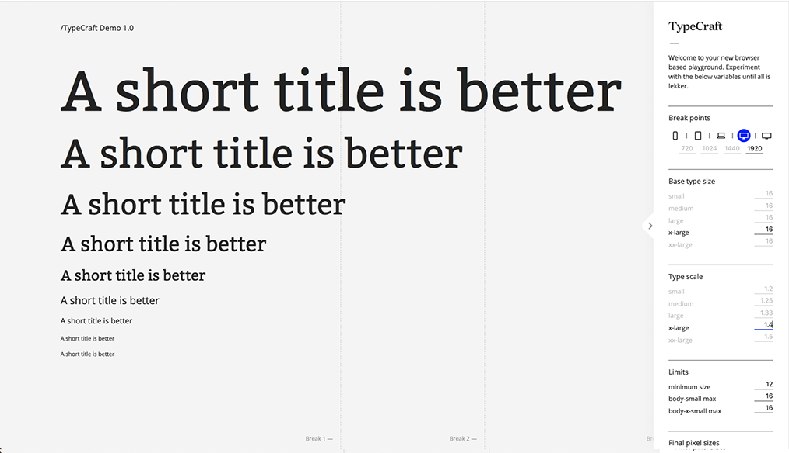

# TypeCraft
<i>a browser based tool for designing scaleable typography.</i>

<h3><strong>No more flying blind!</strong> </h3>
TypeCraft allows you to easily test your typography in the browser. Meaning you can see the scaling and rendering of your type using the technology that will ultimately implement it. This is for reals!
 
 

 
 
<h2><strong>How it works</strong> </h2>
Many browser based tools allow you to render typographic scales. But none can dynamically change the scale based on the breakpoint &#8212; which you can edit btw, TypeCraft does. Then prints the pixel values for you. Your welcome.
 
<h3>Features</h3>
<ul>
<li><strong>Everything is live</strong> &#8212; Make a change, shrink/extend the browser window you will see the change immediately.</li>
<li><strong>Create custom typographic scales</strong> &#8212; Stick to the classics (overview below) or make your own what you type is what you see.</li>
<li><strong>Change your base</strong> &#8212; Choose your base number for each scale.
<li><strong>Create custom breakpoints</strong> &#8212; edit up to 4 breakpoints (5 regions) and see your decisions take effect.</li>
<li><strong>Set limits</strong> &#8212; Ensure your type never drops below a certain sizes</li>
<li><strong>Get hard values</strong> &#8212; solid pixel values for all decisions you make. You can leave the scales in the tool!
<li><strong>Completely customizable</strong> &#8212; Change the font, create mockups, test anything you like as long as your type carries the classes the system will work.</li>
</ul>
 
<h2><strong>Getting started</strong> </h2>

<h3>Launching</h3>

<h4><a href="https://www.dropbox.com/s/od3uh1n0jg84uwk/TypeCraft%201.0.zip?dl=0" target="_blank">Download the latest version<a></h4>
<ul>
<li>Unzip the file and drag 'index.html' on to your browser: chrome, firefox, or safari.</li>
<li> Play &#8212; change the values, set breakpoints, stretch/shrink the browser to see your changes take effect. 
</ul>

<h3>How do I change the font?</h3>

<h4>For a google font:</h4>
<h4>For a desktop font:</h4>
<strong>Step 1 &#8212; Convert</strong> 
As desktop fonts don't play particularly nice in the browser we need to convert the font to a webfont. 

For a .ttf font go <a href="https://everythingfonts.com/ttf-to-woff2" target="_blank">here</a> 
For a .otf font go <a href="https://everythingfonts.com/otf-to-woff2" target="_blank">here</a> 
<ul>
<li>Drag and drop the font onto the input.</li>
<li>Click the "EULAs of this font allow conversion" &#8212; because of course they do.</li>
<li>Click convert, your font will now download as an impossibly named .zip file. Unzip the file and your shiny new webfont will be inside.</li> 
</ul>
<h4>Step 2 &#8212; Install</h4>
<ul>
<li>Drag your webfont into the folder 'fonts' &#8212; typecraft/fonts.</li>
<li>Open the text editor (IDE) of your choice. If you don't have one download Atom <a href="https://atom.io/" target="_blank">here</a></li>
<li>Open the 'index.html' file in your text editor. On the right hand side you will see a list of files. Double click 'style.css'.</li>
</ul>
<h4>Step 3 &#8212; Configure</h4>
In 'style.css' you will see some boilerplate code for the @font-face rule (no need to understand what this is).  
<ul>
<li>Replace "typeface bold" with a name for your font this will be its reference in code. For example for Helvetica Bold, "Helvetica Bold" is a good name. Note you need to do this for each font-weight you want to use.</li> 
<i>Next we will change the path so that the browser can find your font.</i>
</ul>
<ul>
<li>The path name 'fonts/typeface-bold.woff2' already directs to the folder 'fonts' so you only need to change the file name to the file name of your font. For example: 'fonts/my-font.woff2'</li> 
<i>Your font is now loaded. Now our font is loaded we need to apply our font to our class/classes (classes are labels to which instructions can be added &#8212; the TypeCraft class list is below).</i>  
<li>Below 'Header Styling' change the font-family: declaration from "Open Sans" to your font name (they name you gave the font earlier) your font will now render. Nice One.</li>
<li>Repeat for 'Body Styling'.</li>
</ul>

 
<h2><strong>Key information</strong> </h2>
<h3>Class List</h3>
<ul>
<li>hero = .hero</li>
<li>h1 = .h1</li>
<li>h2 = .h2</li>
<li>h3 = .h3</li>
<li>h4 = .h4</li>
<li>body-big = .body-big</li>
<li>body = .body</li>
<li>body-small = .body-small</li>
<li>body-x-small = .body-x-small</li>

